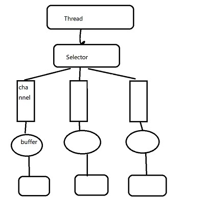

# I/O模型基本介绍

- Java BIO：同步并阻塞（传统阻塞型），服务器实现为一个连接一个线程；
- Java NIO：同步非阻塞，一个线程处理多个连接，客户端发出的请求都会注册到多路复用器上
- Java AIO：异步非阻塞，有效请求才启动线程，特点是先由操作系统完成后才通知服务端程序启动线程去处理，一般适用于连接数较多且连接时间较长的应用。

适用场景：

- BIO适用于连接数目较少且固定的架构
- NIO适用于连接数目多且连接时长比较短的架构，如聊天服务器、弹幕系统
- AIO适用于连接数目较多且时长较长的架构

同步：客户端发出请求后必须等待服务器的响应才可以继续执行；  
异步：客户端发出请求后已经知道如何处理服务器的响应，所以不需要等待即可发出新的请求（Ajax）
## BIO
### Java BIO存在的问题
1、每个请求都需要创建独立的线程，与对应客户端进行通信  
2、当并发数较大时，需要创建大量的线程来处理连接，系统资源占用较大  
3、连接建立后，如果当前线程暂时没有数据可读则线程就阻塞在read操作上，造成线程资源浪费

## NIO
NIO三大核心部分：Channel（通道）、Buffer（缓冲区）、Selector（选择器）  
NIO是面向缓冲区或者是面向块编程的。数据读取到一个它稍后处理的缓冲区，需要时可在缓冲区中前后移动，这就增加了处理过程中的灵活性，使用它可以提供非阻塞式的高伸缩性网络

NIO非阻塞模式：一个线程请求写入一些数据到通道，但不需要等待它完全写入，这个线程同时可以去做别的事情；一个线程请求读取一些数据，但是它仅能获取目前可用的数据，如果目前没有数据可用时，就什么都不获取，而不是保持线程阻塞。

### Channel、Buffer、Selector的关系
- 每个channel都会对应一个buffer
- Selector对应一个线程，一个线程对应多个channel（连接）
- 程序切换到哪个channel是由事件决定的，event是一个重要的概念
- buffer就是一个内存块，底层是由数组实现的
- 数据的读写是通过buffer，BIO中要么是输入流要么是输出流，不能双向；但NIO的buffer是可以双向读写的，需要flip方法切换
- channel是双向的，可以返回底层操作系统的情况  

### channel
- channel可以同时进行读写
- channel可以实现异步读写数据
- channel可以从缓冲读数据，也可以写数据到缓冲

常用的channel类
- FileChannel 用于文件的数据读写
- DatagramChannel 用于UDP的数据读写
- ServerSocketChannel 类似于ServerSocket，用于TCP的数据读写
- SocketChannel 类似于Socket，用于TCP的数据读写