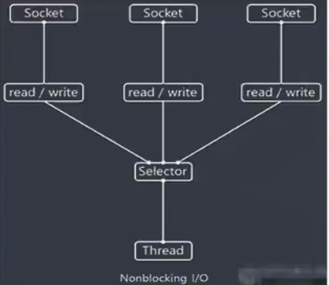

Selector能够检测多个注册的通道上是否有事件发生（多个Channel以事件的方式可以注册到同一个Selector）。  
如果有事件发生，便获取事件然后对每个事件进行相应的处理。当线程从客户端Socket通道进行读写数据时，若没有数据可用时，该线程可以进行其它任务。这样就可以只用一个单线程去管理多个通道，也就是管理多个连接和请求。  

只有在连接真正有读写事件发生时，才会进行读写，就大大减少了系统开销，并且不必为每个连接都创建一个线程，不用去维护多线程，避免了多线程之间的上下文切换导致的开销

读写操作都是非阻塞的，充分提升IO线程的运行效率，避免由于频繁IO阻塞导致的线程挂起

NIO网络编程流程图
1、当有客户端连接时，会通过ServerSocketChannel得到SocketChannel  
2、Selector进行监听select方法，返回有事件发生的通道的个数  
3、将SocketChannel注册到Selector上，一个Selector可以注册多个channel  
4、注册后会返回一个SelectionKey，会和该Selector关联（集合）  
5、有事件发生则会得到SelectorKey集合  
6、可以通过SelectorKey反向得到channel

Selector真实实例是WindowsSelectorImpl类