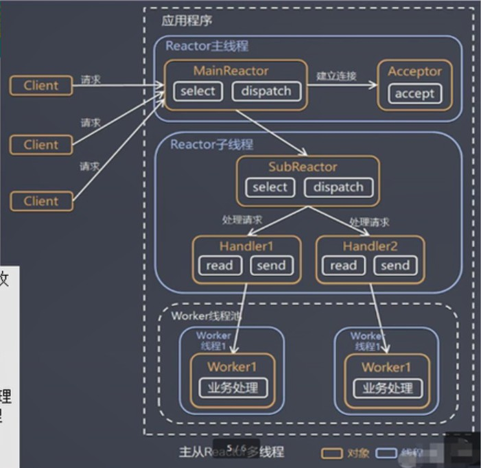

 原生NIO存在的问题：  
1、NIO的类库和API繁杂，使用麻烦  
2、开发工作量和难度都很大  
3、NIO存在bug  

Netty优点：  
开发效率高、高性能、社区活跃  

## 线程模型
目前存在的线程模型：传统阻塞I/O服务模型、Reactor模式（反应器模式）

根据Reactor的数量和处理资源池线程的数量的不同，有3钟典型的实现
- 单Reactor单线程
- 单Reactor多线程
- 主从Reactor多线程

netty主要基于主从Reactor多线程模型做了一定的改进，其中主从Reactor多线程有多个Reactor

### 传统阻塞I/O服务模型
模型特点：
- 采用阻塞IO模式获取输入的数据
- 每个连接都需要独立的线程完成数据的输入、业务处理、数据返回     

问题分析：
- 当并发量很大时，就会创建大量的线程，占用很大系统资源
- 连接创建后，如果当前线程没有数据可读，该线程会阻塞在read操作，造成线程资源浪费

### Reactor模式
针对传统阻塞I/O服务模型的缺点，有如下解决方案：
- 基于I/O复用模型：多个连接共用一个阻塞对象，应用程序只需要在一个阻塞对象等待，无需阻塞等待所有连接。当某个连接有新的数据可以处理时，操作系统通知应用程序，线程从阻塞状态返回，开始进行业务处理
- 基于线程池复用线程资源：不必为每个连接创建线程，将连接完成后的业务处理任务分配给线程进行处理，一个线程可以处理多个连接

优点：
- 响应快，不必为单个同步时间所阻塞，虽然
- 可以最大程度的避免复杂的多线程及同步问题，避免了多线程/进程的切换开销
- 扩展性好，可以方便的通过增加reactor实例个数来充分利用CPU资源
- 复用性好，reactor模型本身与具体事件处理逻辑无关，具有很高的复用性

I/O复用结合线程池就是Reactor模式基本设计思想。

（1）、Reactor模式，通过一个或多个输入的同时传递给服务处理器的模式（基于事件驱动）
（2）、服务器端程序处理传入的多个请求，并将它们同步分派到相应的处理线程
（3）、Reactor模式使用IO复用监听事件，收到事件后，分发给某个线程，这点就是网络服务器高并发处理关键

#### 单Reactor单线程
优点：模型简单，没有多线程、进程通信、竞争的问题，全部都在一个线程完成  
缺点：性能问题，只有一个线程，无法完全发挥多核CPU的的性能。handler在处理某个连接上的业务时，整个进程无法处理其它连接事件；可靠性问题，线程意外终止，或者陷入死循环，会导致整个系统通信模块不可用

#### 单Reactor多线程

1）、Reactor对象通过select监控客户端请求事件，通过dispatch进行分发  
2）、如果建立连接请求，则Acceptor通过accept处理各种l连接请求，然后创建一个handler对象处理完成连接后的各种事件  
3）、如果不是连接请求，则由reactor分发调用连接对应的handler来处理  
4）、handler只负责响应事件，不做具体的业务处理，通过read读取数据后，会分发给后面的worker线程池里的某个线程来处理业务  
5）、worker线程池会分配独立线程完成真正的业务，并将结果返回给handler  
6）、handler收到响应后，通过send将结果返回给client  

优点：可以充分利用多核CPU的处理能力  
缺点：多线程数据共享和访问比较复杂，reactor处理所有的事件的监听和响应，在单线程运行，在高并发场景容易出现瓶颈  

#### 主从reactor多线程
  
1）、reactor主线程mainreactor对象通过select监听连接事件，收到事件后通过Acceptor处理连接事件    
2）、当acceptor处理连接事件后，mainreactor将连接分配给subreactor  
3）、subreactor将连接加入到连接队列后进行监听，并创建handler进行各种事件处理  
4）、当有新事件发生时，subreactor就会调用对应的handler处理  
5）、handler通过read读取数据，分发给后面的worker线程处理  
6）、worker线程池分配独立的worker线程进行业务处理，并返回结果  
7）、handler收到响应的结果后，再通过send将结果返回给client  
8）、reactor主线程可以对应多个reactor子线程  